# 6.55 ＦＭ音源６オペレータモードの接続形態

[← 目次](../index.md)

６オペレータモードの音色設定における、  
`CON`（connection：オペレータの接続パターン）  
の内容を示します。

対象となる音色定義は、次の通りです。

```
#MB:FMS_6OP
```

以下に、`CON`番号ごとの接続図を示します。

「out」は音声出力です。  
色が白のオペレータがモジュレータです。  
色がオレンジのオペレータがキャリアです。  
キャリアが複数ある`CON`では、コーラスや和音の効果を出すことも可能です。

全てのオペレータにセルフフィードバック機能があります。

６オペレータモードの `CON` は、0〜63 で指定します。  

### グループ１：CON=0〜9：[1,2,3,4,5,6]

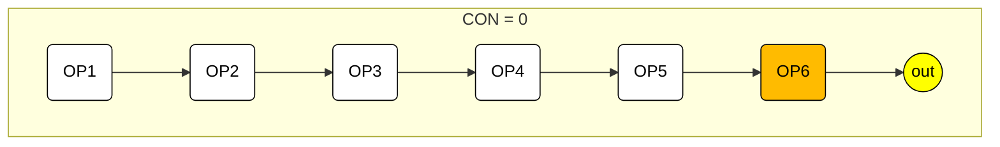

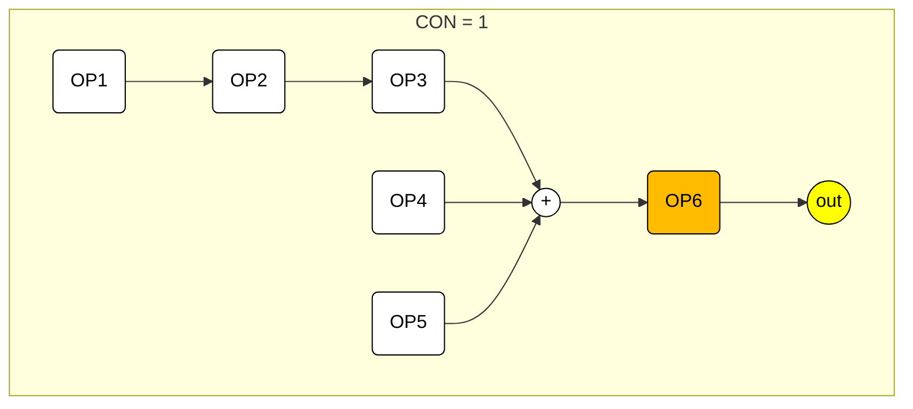

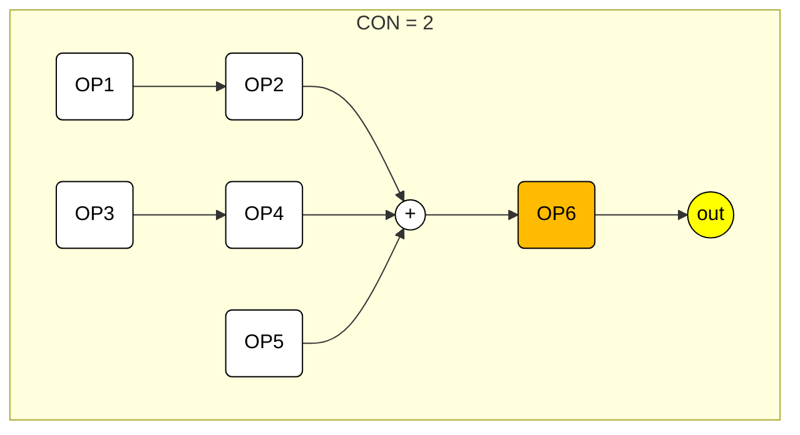

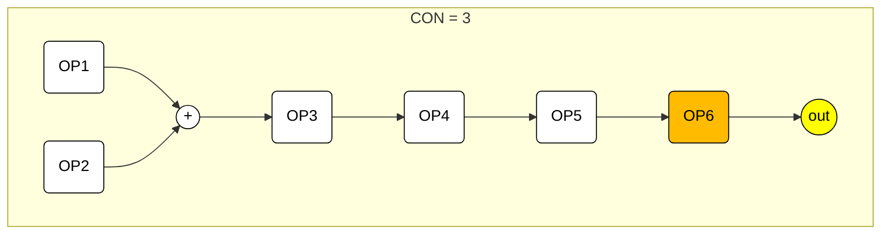

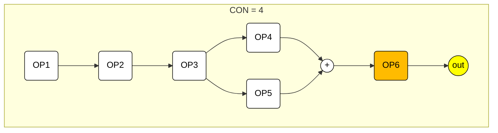

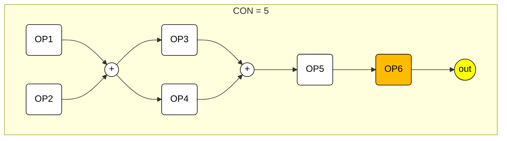

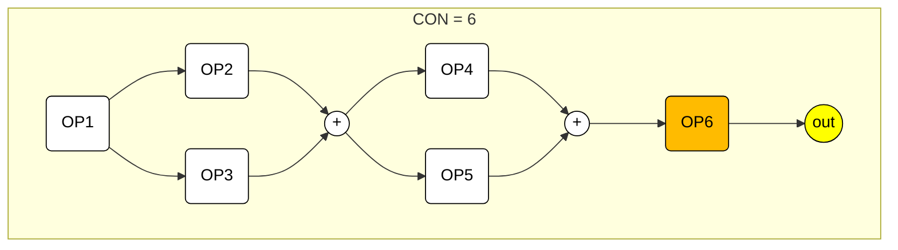

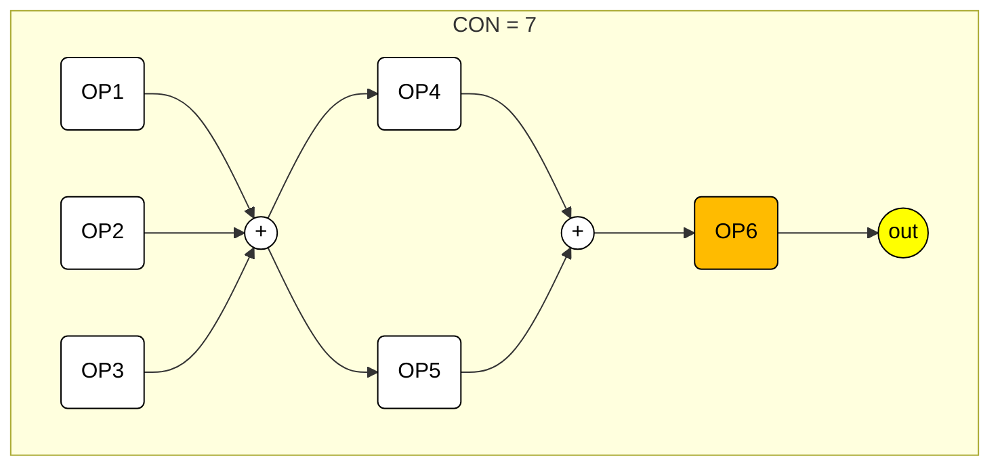

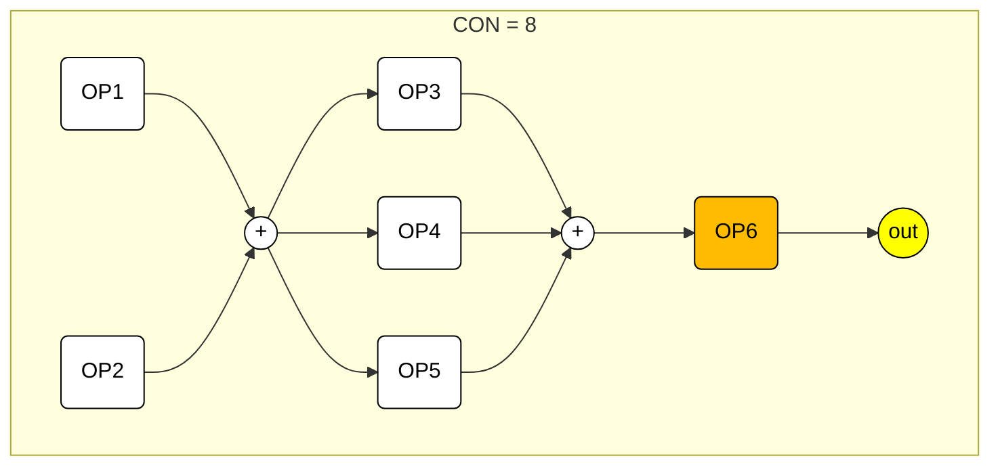

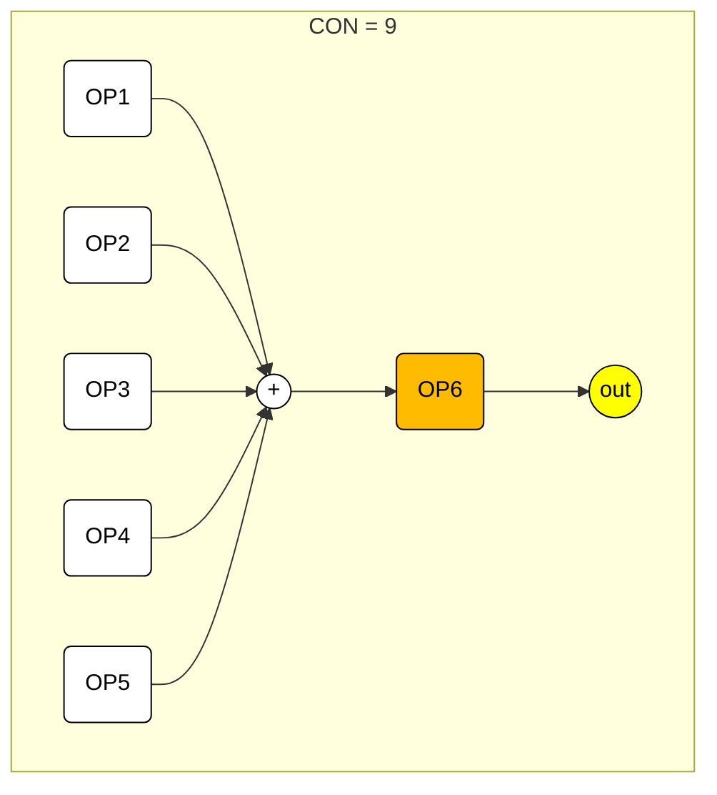

### グループ２：CON=10〜21：[1,2,3,4,5][6]

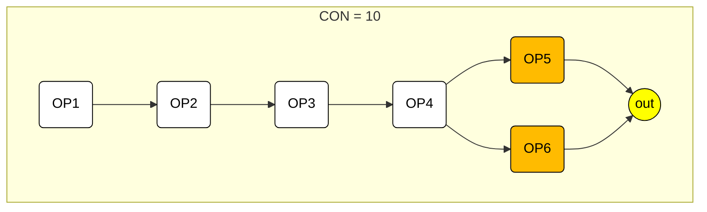

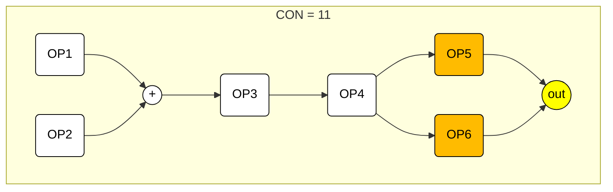

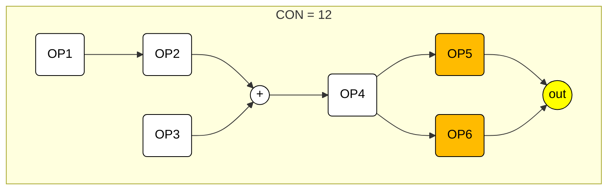

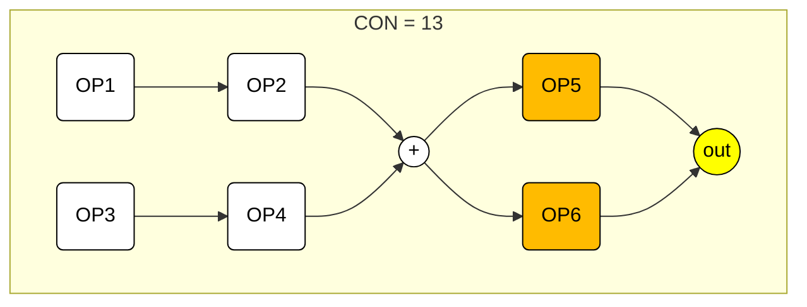

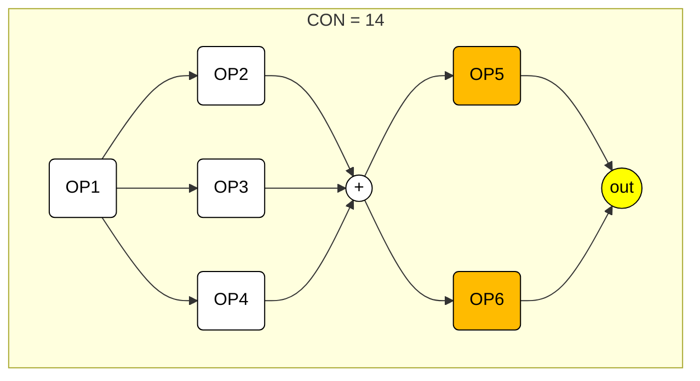

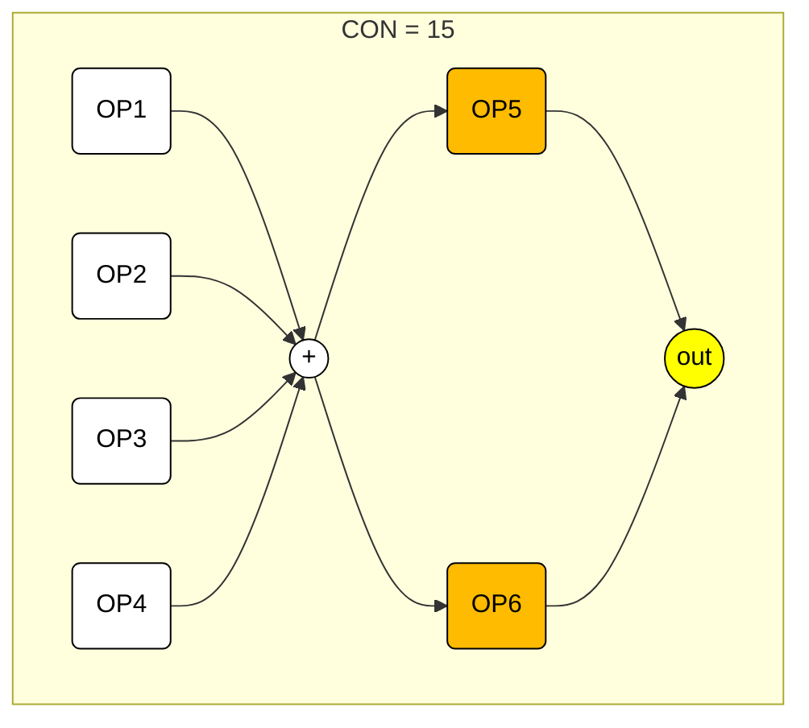

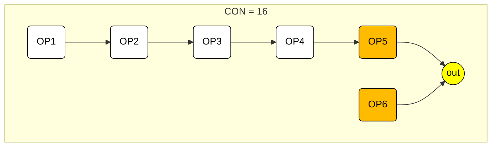

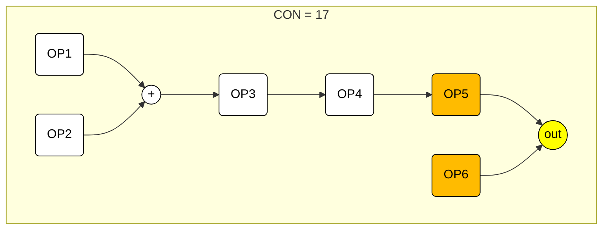

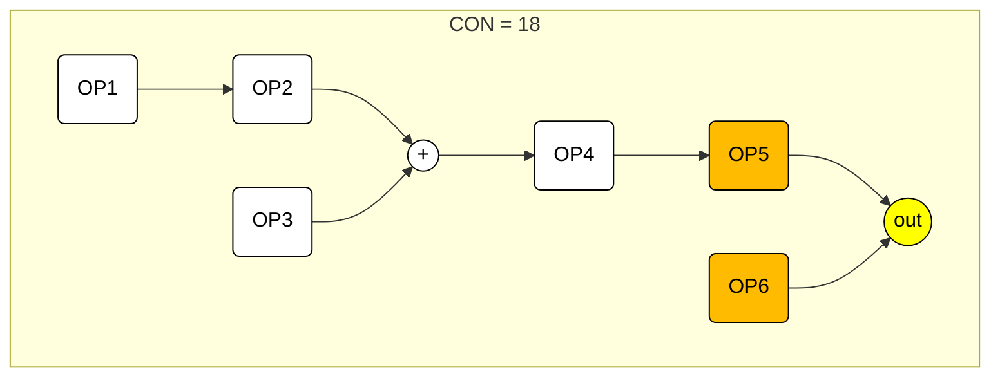

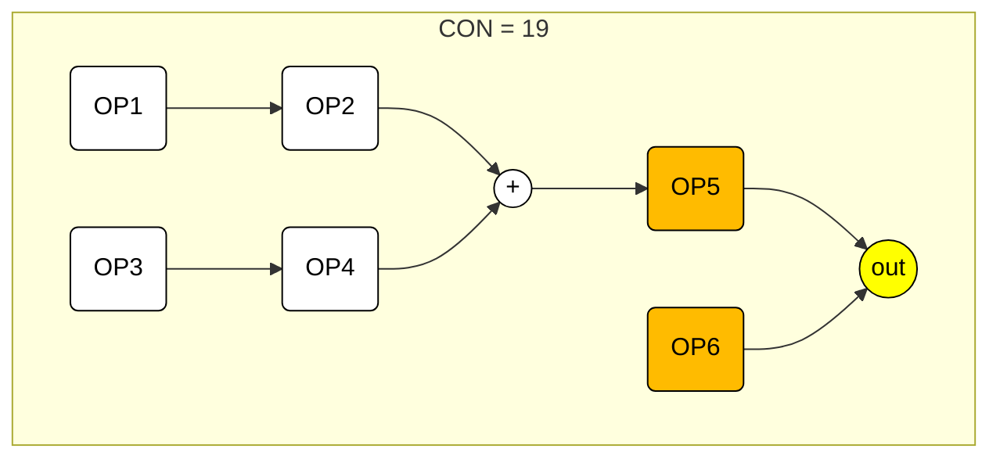

```mermaid
flowchart LR
  subgraph CON["CON = 20"]
    direction LR
    OP1("OP1") --> OP2("OP2") --> S(("+")) --> OP5("OP5") --> OUT(("out"))
    OP1("OP1") --> OP3("OP3") --> S(("+"))
    OP1("OP1") --> OP4("OP4") --> S(("+"))
    OP6("OP6") --> OUT(("out"))
  end
style OP1 fill:#fff, stroke:#000, color:#000
style OP2 fill:#fff, stroke:#000, color:#000
style OP3 fill:#fff, stroke:#000, color:#000
style OP4 fill:#fff, stroke:#000, color:#000
style OP5 fill:#fb0, stroke:#000, color:#000
style OP6 fill:#fb0, stroke:#000, color:#000
style S   fill:#fff, stroke:#000, color:#000
style OUT fill:#ff0, stroke:#000, color:#000
```

```mermaid
flowchart LR
  subgraph CON["CON = 21"]
    direction LR
    OP1("OP1") --> S(("+")) --> OP5("OP5") --> OUT(("out"))
    OP2("OP2") --> S(("+"))
    OP3("OP3") --> S(("+"))
    OP4("OP4") --> S(("+"))
    OP6("OP6") --> OUT(("out"))
  end
style OP1 fill:#fff, stroke:#000, color:#000
style OP2 fill:#fff, stroke:#000, color:#000
style OP3 fill:#fff, stroke:#000, color:#000
style OP4 fill:#fff, stroke:#000, color:#000
style OP5 fill:#fb0, stroke:#000, color:#000
style OP6 fill:#fb0, stroke:#000, color:#000
style S   fill:#fff, stroke:#000, color:#000
style OUT fill:#ff0, stroke:#000, color:#000
```

### グループ３：CON=22〜25：[1,2,3,4][5,6]

```mermaid
flowchart LR
  subgraph CON["CON = 22"]
    direction LR
    OP1("OP1") --> OP2("OP2") --> OP3("OP3") --> OP4("OP4") --> OUT(("out"))
    OP5("OP5") --> OP6("OP6") --> OUT(("out"))
  end
style OP1 fill:#fff, stroke:#000, color:#000
style OP2 fill:#fff, stroke:#000, color:#000
style OP3 fill:#fff, stroke:#000, color:#000
style OP4 fill:#fb0, stroke:#000, color:#000
style OP5 fill:#fff, stroke:#000, color:#000
style OP6 fill:#fb0, stroke:#000, color:#000
style OUT fill:#ff0, stroke:#000, color:#000
```

```mermaid
flowchart LR
  subgraph CON["CON = 23"]
    direction LR
    OP1("OP1") --> S(("+")) --> OP3("OP3") --> OP4("OP4") --> OUT(("out"))
    OP2("OP2") --> S(("+"))
    OP5("OP5") --> OP6("OP6") --> OUT(("out"))
  end
style OP1 fill:#fff, stroke:#000, color:#000
style OP2 fill:#fff, stroke:#000, color:#000
style OP3 fill:#fff, stroke:#000, color:#000
style OP4 fill:#fb0, stroke:#000, color:#000
style OP5 fill:#fff, stroke:#000, color:#000
style OP6 fill:#fb0, stroke:#000, color:#000
style S   fill:#fff, stroke:#000, color:#000
style OUT fill:#ff0, stroke:#000, color:#000
```

```mermaid
flowchart LR
  subgraph CON["CON = 24"]
    direction LR
    OP1("OP1") --> OP2("OP2") --> S(("+")) --> OP4("OP4") --> OUT(("out"))
    OP3("OP3") --> S(("+"))
    OP5("OP5") --> OP6("OP6") --> OUT(("out"))
  end
style OP1 fill:#fff, stroke:#000, color:#000
style OP2 fill:#fff, stroke:#000, color:#000
style OP3 fill:#fff, stroke:#000, color:#000
style OP4 fill:#fb0, stroke:#000, color:#000
style OP5 fill:#fff, stroke:#000, color:#000
style OP6 fill:#fb0, stroke:#000, color:#000
style S   fill:#fff, stroke:#000, color:#000
style OUT fill:#ff0, stroke:#000, color:#000
```

```mermaid
flowchart LR
  subgraph CON["CON = 25"]
    direction LR
    OP1("OP1") --> S(("+")) --> OP4("OP4") --> OUT(("out"))
    OP2("OP2") --> S(("+"))
    OP3("OP3") --> S(("+"))
    OP5("OP5") --> OP6("OP6") --> OUT(("out"))
  end
style OP1 fill:#fff, stroke:#000, color:#000
style OP2 fill:#fff, stroke:#000, color:#000
style OP3 fill:#fff, stroke:#000, color:#000
style OP4 fill:#fb0, stroke:#000, color:#000
style OP5 fill:#fff, stroke:#000, color:#000
style OP6 fill:#fb0, stroke:#000, color:#000
style S   fill:#fff, stroke:#000, color:#000
style OUT fill:#ff0, stroke:#000, color:#000
```

### グループ４：CON=26〜28：[1,2,3][4,5,6]

```mermaid
flowchart LR
  subgraph CON["CON = 26"]
    direction LR
    OP1("OP1") --> OP2("OP2") --> OP3("OP3") --> OUT(("out"))
    OP4("OP4") --> OP5("OP5") --> OP6("OP6") --> OUT(("out"))
  end
style OP1 fill:#fff, stroke:#000, color:#000
style OP2 fill:#fff, stroke:#000, color:#000
style OP3 fill:#fb0, stroke:#000, color:#000
style OP4 fill:#fff, stroke:#000, color:#000
style OP5 fill:#fff, stroke:#000, color:#000
style OP6 fill:#fb0, stroke:#000, color:#000
style OUT fill:#ff0, stroke:#000, color:#000
```

```mermaid
flowchart LR
  subgraph CON["CON = 27"]
    direction LR
    OP1("OP1") --> S(("+")) --> OP3("OP3") --> OUT(("out"))
    OP2("OP2") --> S(("+"))
    OP4("OP4") --> OP5("OP5") --> OP6("OP6") --> OUT(("out"))
  end
style OP1 fill:#fff, stroke:#000, color:#000
style OP2 fill:#fff, stroke:#000, color:#000
style OP3 fill:#fb0, stroke:#000, color:#000
style OP4 fill:#fff, stroke:#000, color:#000
style OP5 fill:#fff, stroke:#000, color:#000
style OP6 fill:#fb0, stroke:#000, color:#000
style S   fill:#fff, stroke:#000, color:#000
style OUT fill:#ff0, stroke:#000, color:#000
```

```mermaid
flowchart LR
  subgraph CON["CON = 28"]
    direction LR
    OP1("OP1") --> S1(("+")) --> OP3("OP3") --> OUT(("out"))
    OP2("OP2") --> S1(("+"))
    OP4("OP4") --> S2(("+")) --> OP6("OP6") --> OUT(("out"))
    OP5("OP5") --> S2(("+"))
  end
style OP1 fill:#fff, stroke:#000, color:#000
style OP2 fill:#fff, stroke:#000, color:#000
style OP3 fill:#fb0, stroke:#000, color:#000
style OP4 fill:#fff, stroke:#000, color:#000
style OP5 fill:#fff, stroke:#000, color:#000
style OP6 fill:#fb0, stroke:#000, color:#000
style S1  fill:#fff, stroke:#000, color:#000
style S2  fill:#fff, stroke:#000, color:#000
style OUT fill:#ff0, stroke:#000, color:#000
```

### グループ５：CON=29〜40：[1,2,3,4][5][6]

```mermaid
flowchart LR
  subgraph CON["CON = 29"]
    direction LR
    OP1("OP1") --> OP2("OP2") --> OP3("OP3") --> OP4("OP4") --> OUT(("out"))
    OP3("OP3") --> OP5("OP5") --> OUT(("out"))
    OP3("OP3") --> OP6("OP6") --> OUT(("out"))
  end
style OP1 fill:#fff, stroke:#000, color:#000
style OP2 fill:#fff, stroke:#000, color:#000
style OP3 fill:#fff, stroke:#000, color:#000
style OP4 fill:#fb0, stroke:#000, color:#000
style OP5 fill:#fb0, stroke:#000, color:#000
style OP6 fill:#fb0, stroke:#000, color:#000
style OUT fill:#ff0, stroke:#000, color:#000
```

```mermaid
flowchart LR
  subgraph CON["CON = 30"]
    direction LR
    OP1("OP1") --> S(("+")) --> OP3("OP3") --> OP4("OP4") --> OUT(("out"))
    OP2("OP2") --> S(("+"))
    OP3("OP3") --> OP5("OP5") --> OUT(("out"))
    OP3("OP3") --> OP6("OP6") --> OUT(("out"))
  end
style OP1 fill:#fff, stroke:#000, color:#000
style OP2 fill:#fff, stroke:#000, color:#000
style OP3 fill:#fff, stroke:#000, color:#000
style OP4 fill:#fb0, stroke:#000, color:#000
style OP5 fill:#fb0, stroke:#000, color:#000
style OP6 fill:#fb0, stroke:#000, color:#000
style S   fill:#fff, stroke:#000, color:#000
style OUT fill:#ff0, stroke:#000, color:#000
```

```mermaid
flowchart LR
  subgraph CON["CON = 31"]
    direction LR
    OP1("OP1") --> OP2("OP2") --> S(("+")) --> OP4("OP4") --> OUT(("out"))
    S(("+")) --> OP5("OP5") --> OUT(("out"))
    OP3("OP3") --> S(("+")) --> OP6("OP6") --> OUT(("out"))
  end
style OP1 fill:#fff, stroke:#000, color:#000
style OP2 fill:#fff, stroke:#000, color:#000
style OP3 fill:#fff, stroke:#000, color:#000
style OP4 fill:#fb0, stroke:#000, color:#000
style OP5 fill:#fb0, stroke:#000, color:#000
style OP6 fill:#fb0, stroke:#000, color:#000
style S   fill:#fff, stroke:#000, color:#000
style OUT fill:#ff0, stroke:#000, color:#000
```

```mermaid
flowchart LR
  subgraph CON["CON = 32"]
    direction LR
    OP1("OP1") --> S(("+")) --> OP4("OP4") --> OUT(("out"))
    OP2("OP2") --> S(("+")) --> OP5("OP5") --> OUT(("out"))
    OP3("OP3") --> S(("+")) --> OP6("OP6") --> OUT(("out"))
  end
style OP1 fill:#fff, stroke:#000, color:#000
style OP2 fill:#fff, stroke:#000, color:#000
style OP3 fill:#fff, stroke:#000, color:#000
style OP4 fill:#fb0, stroke:#000, color:#000
style OP5 fill:#fb0, stroke:#000, color:#000
style OP6 fill:#fb0, stroke:#000, color:#000
style S   fill:#fff, stroke:#000, color:#000
style OUT fill:#ff0, stroke:#000, color:#000
```

```mermaid
flowchart LR
  subgraph CON["CON = 33"]
    direction LR
    OP1("OP1") --> OP2("OP2") --> OP3("OP3") --> OP4("OP4") --> OUT(("out"))
    OP3("OP3") --> OP5("OP5") --> OUT(("out"))
    OP6("OP6") --> OUT(("out"))
  end
style OP1 fill:#fff, stroke:#000, color:#000
style OP2 fill:#fff, stroke:#000, color:#000
style OP3 fill:#fff, stroke:#000, color:#000
style OP4 fill:#fb0, stroke:#000, color:#000
style OP5 fill:#fb0, stroke:#000, color:#000
style OP6 fill:#fb0, stroke:#000, color:#000
style OUT fill:#ff0, stroke:#000, color:#000
```

```mermaid
flowchart LR
  subgraph CON["CON = 34"]
    direction LR
    OP1("OP1") --> S(("+")) --> OP3("OP3") --> OP4("OP4") --> OUT(("out"))
    OP2("OP2") --> S(("+"))
    OP3("OP3") --> OP5("OP5") --> OUT(("out"))
    OP6("OP6") --> OUT(("out"))
  end
style OP1 fill:#fff, stroke:#000, color:#000
style OP2 fill:#fff, stroke:#000, color:#000
style OP3 fill:#fff, stroke:#000, color:#000
style OP4 fill:#fb0, stroke:#000, color:#000
style OP5 fill:#fb0, stroke:#000, color:#000
style OP6 fill:#fb0, stroke:#000, color:#000
style S   fill:#fff, stroke:#000, color:#000
style OUT fill:#ff0, stroke:#000, color:#000
```

```mermaid
flowchart LR
  subgraph CON["CON = 35"]
    direction LR
    OP1("OP1") --> OP2("OP2") --> S(("+")) --> OP4("OP4") --> OUT(("out"))
    S(("+")) --> OP5("OP5") --> OUT(("out"))
    OP3("OP3") --> S(("+"))
    OP6("OP6") --> OUT(("out"))
  end
style OP1 fill:#fff, stroke:#000, color:#000
style OP2 fill:#fff, stroke:#000, color:#000
style OP3 fill:#fff, stroke:#000, color:#000
style OP4 fill:#fb0, stroke:#000, color:#000
style OP5 fill:#fb0, stroke:#000, color:#000
style OP6 fill:#fb0, stroke:#000, color:#000
style S   fill:#fff, stroke:#000, color:#000
style OUT fill:#ff0, stroke:#000, color:#000
```

```mermaid
flowchart LR
  subgraph CON["CON = 36"]
    direction LR
    OP1("OP1") --> S(("+")) --> OP4("OP4") --> OUT(("out"))
    OP2("OP2") --> S(("+")) --> OP5("OP5") --> OUT(("out"))
    OP3("OP3") --> S(("+"))
    OP6("OP6") --> OUT(("out"))
  end
style OP1 fill:#fff, stroke:#000, color:#000
style OP2 fill:#fff, stroke:#000, color:#000
style OP3 fill:#fff, stroke:#000, color:#000
style OP4 fill:#fb0, stroke:#000, color:#000
style OP5 fill:#fb0, stroke:#000, color:#000
style OP6 fill:#fb0, stroke:#000, color:#000
style S   fill:#fff, stroke:#000, color:#000
style OUT fill:#ff0, stroke:#000, color:#000
```

```mermaid
flowchart LR
  subgraph CON["CON = 37"]
    direction LR
    OP1("OP1") --> OP2("OP2") --> OP3("OP3") --> OP4("OP4") --> OUT(("out"))
    OP5("OP5") --> OUT(("out"))
    OP6("OP6") --> OUT(("out"))
  end
style OP1 fill:#fff, stroke:#000, color:#000
style OP2 fill:#fff, stroke:#000, color:#000
style OP3 fill:#fff, stroke:#000, color:#000
style OP4 fill:#fb0, stroke:#000, color:#000
style OP5 fill:#fb0, stroke:#000, color:#000
style OP6 fill:#fb0, stroke:#000, color:#000
style OUT fill:#ff0, stroke:#000, color:#000
```

```mermaid
flowchart LR
  subgraph CON["CON = 38"]
    direction LR
    OP1("OP1") --> S(("+")) --> OP3("OP3") --> OP4("OP4") --> OUT(("out"))
    OP2("OP2") --> S(("+"))
    OP5("OP5") --> OUT(("out"))
    OP6("OP6") --> OUT(("out"))
  end
style OP1 fill:#fff, stroke:#000, color:#000
style OP2 fill:#fff, stroke:#000, color:#000
style OP3 fill:#fff, stroke:#000, color:#000
style OP4 fill:#fb0, stroke:#000, color:#000
style OP5 fill:#fb0, stroke:#000, color:#000
style OP6 fill:#fb0, stroke:#000, color:#000
style S   fill:#fff, stroke:#000, color:#000
style OUT fill:#ff0, stroke:#000, color:#000
```

```mermaid
flowchart LR
  subgraph CON["CON = 39"]
    direction LR
    OP1("OP1") --> OP2("OP2") --> S(("+")) --> OP4("OP4") --> OUT(("out"))
    OP3("OP3") --> S(("+"))
    OP5("OP5") --> OUT(("out"))
    OP6("OP6") --> OUT(("out"))
  end
style OP1 fill:#fff, stroke:#000, color:#000
style OP2 fill:#fff, stroke:#000, color:#000
style OP3 fill:#fff, stroke:#000, color:#000
style OP4 fill:#fb0, stroke:#000, color:#000
style OP5 fill:#fb0, stroke:#000, color:#000
style OP6 fill:#fb0, stroke:#000, color:#000
style S   fill:#fff, stroke:#000, color:#000
style OUT fill:#ff0, stroke:#000, color:#000
```

```mermaid
flowchart LR
  subgraph CON["CON = 40"]
    direction LR
    OP1("OP1") --> S(("+")) --> OP4("OP4") --> OUT(("out"))
    OP2("OP2") --> S(("+"))
    OP3("OP3") --> S(("+"))
    OP5("OP5") --> OUT(("out"))
    OP6("OP6") --> OUT(("out"))
  end
style OP1 fill:#fff, stroke:#000, color:#000
style OP2 fill:#fff, stroke:#000, color:#000
style OP3 fill:#fff, stroke:#000, color:#000
style OP4 fill:#fb0, stroke:#000, color:#000
style OP5 fill:#fb0, stroke:#000, color:#000
style OP6 fill:#fb0, stroke:#000, color:#000
style S   fill:#fff, stroke:#000, color:#000
style OUT fill:#ff0, stroke:#000, color:#000
```

### グループ６：CON=41〜44：[1,2,3][4,5][6]


### グループ７：CON=45：[1,2][3,4][5,6]


### グループ８：CON=46〜53：[1,2,3][4][5][6]


### グループ９：CON=54〜56：[1,2][3,4][5][6]


### グループ１０：CON=57：[1,2][3][4,5][6]


### グループ１１：CON=58〜62：[1,2][3][4][5][6]


### グループ１２：CON=63：[1][2][3][4][5][6]


