# 6.56 ＦＭ音源４オペレータモードの接続形態

[← 目次](../index.md)

４オペレータモードの音色設定における、  
`CON`（connection：オペレータの接続パターン）  
の内容を示します。

対象となる音色定義は、次の通りです。

```
#MB:FMS_4OP
#MB:FMS_OPM （ＯＰＭ互換）
#MB:FMS_OPNA（ＯＰＮＡ互換）
#MB:FMS_OPN （ＯＰＮ互換）
```

以下に、`CON`番号ごとの接続図を示します。

「out」は音声出力です。  
色が白のオペレータがモジュレータです。  
色がオレンジのオペレータがキャリアです。  
キャリアが複数ある`CON`では、コーラスや和音の効果を出すことも可能です。

全てのオペレータにセルフフィードバック機能があります。

４オペレータモードの `CON` は、0〜13 で指定します。  
（通常 0〜7、拡張 8〜13）

### 通常の接続形態（CON=0 〜 CON=7）：

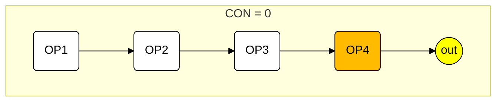

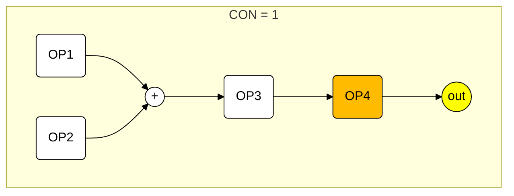

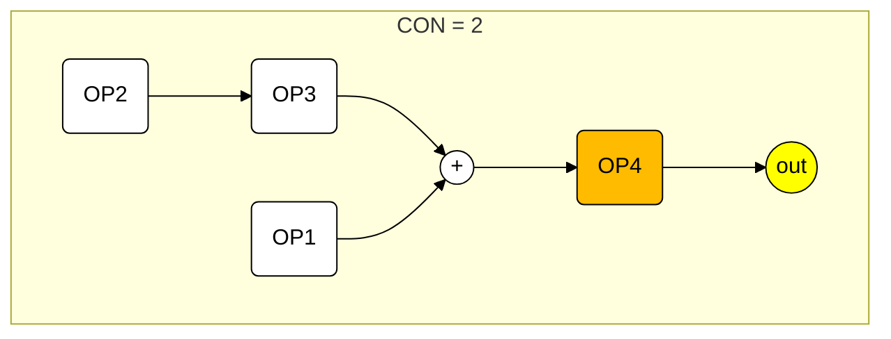


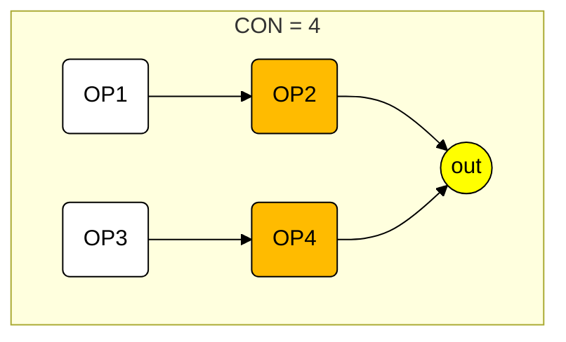

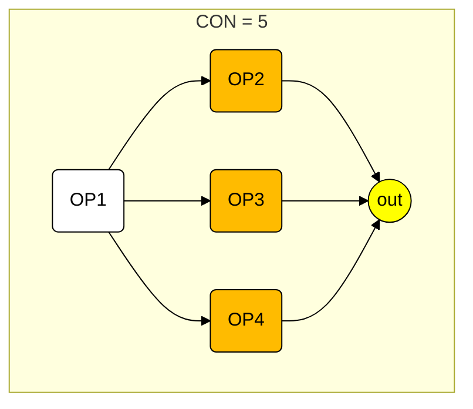

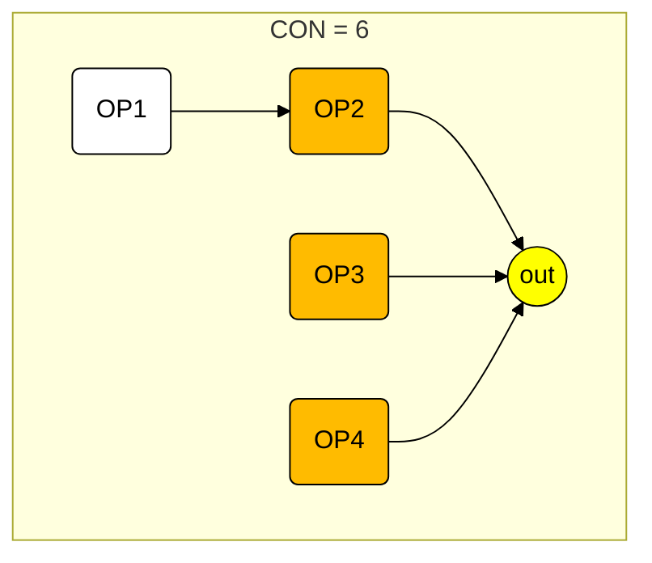

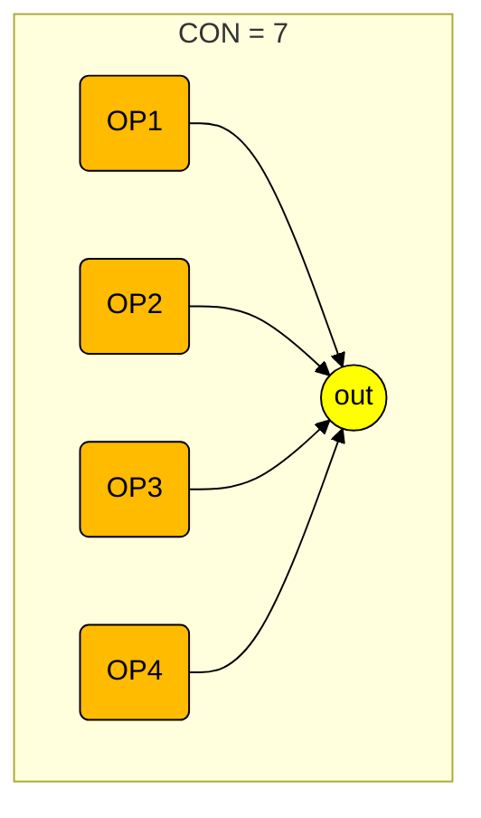

### 独自拡張の接続形態（CON=8 〜 CON=13）：

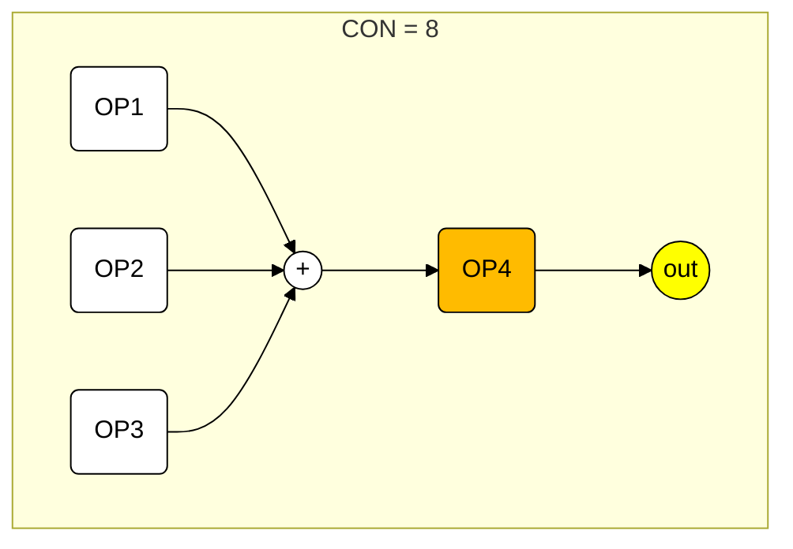

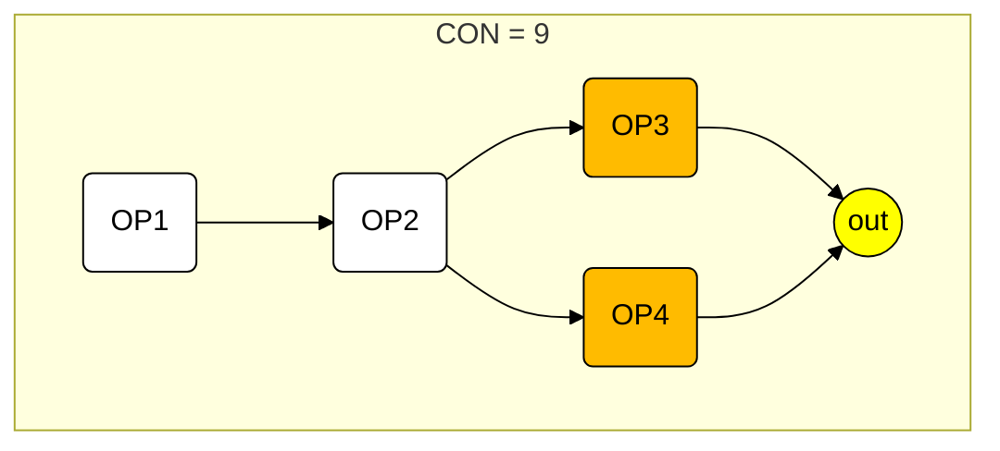

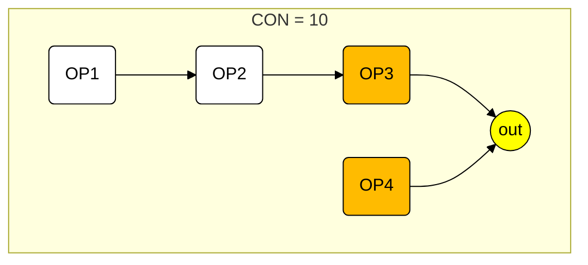

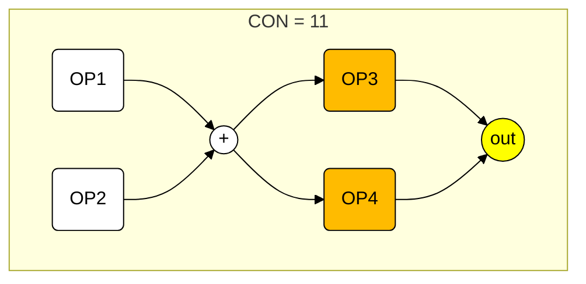

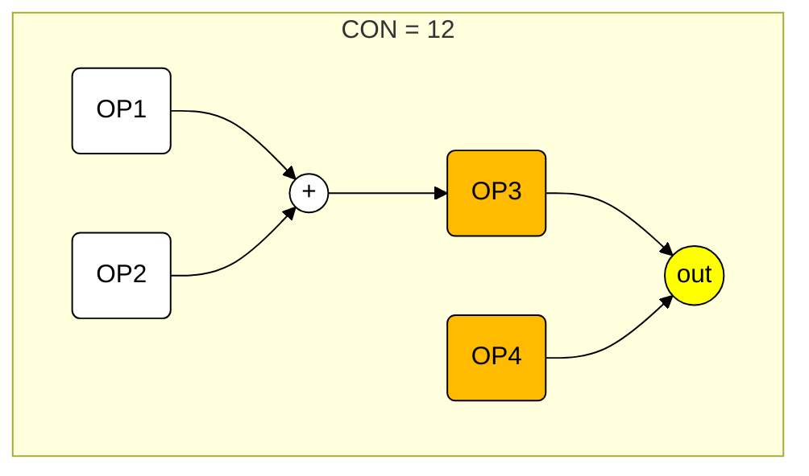

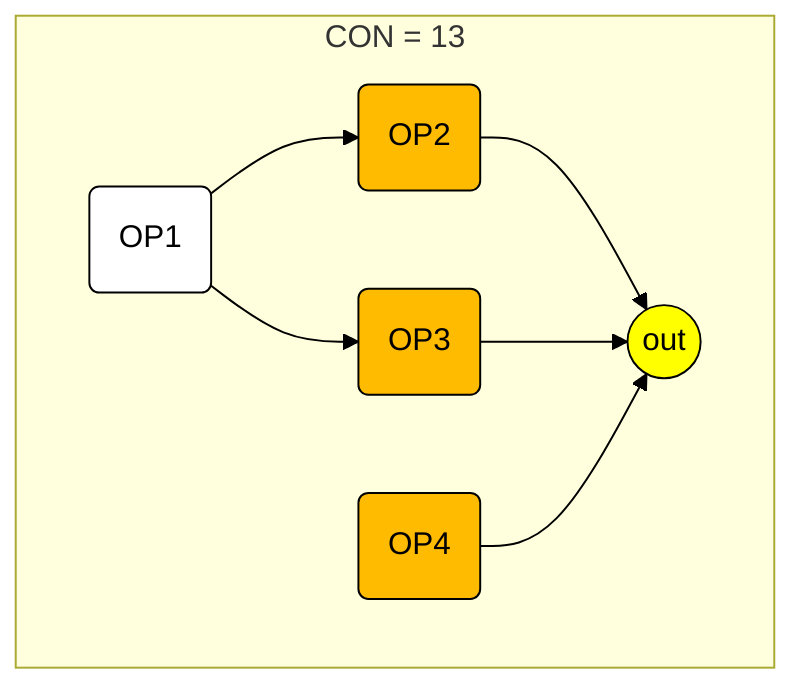

