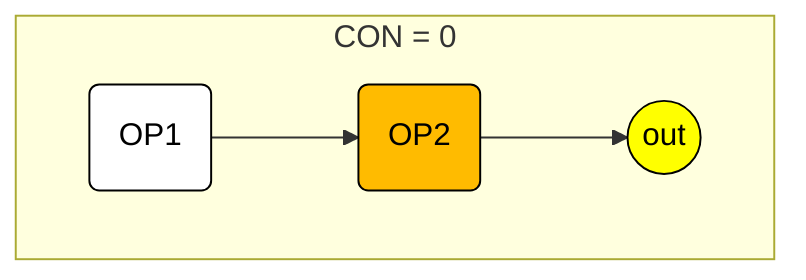
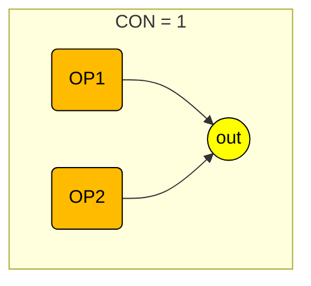

# 6.57 ＦＭ音源２オペレータモードの接続形態

[← 目次](../index.md)

２オペレータモードの音色設定における、  
`CON`（connection：オペレータの接続パターン）  
の内容を示します。

対象となる音色定義は、次の通りです。

```
#MB:FMS_2OP
```

以下に、`CON`番号ごとの接続図を示します。

「out」は音声出力です。  
色が白のオペレータがモジュレータです。  
色がオレンジのオペレータがキャリアです。  
キャリアが複数ある`CON`では、コーラスや和音の効果を出すことも可能です。

全てのオペレータにセルフフィードバック機能があります。

２オペレータモードの `CON` は、0〜1 で指定します。





