# 8.18 ＬＦＯ波形グラフ（１）（@lp/@lb/@lf）

[← 目次](../index.md)

ＬＦＯ波形グラフ（１）：@lp/@lb/@lfの変化パターン

---

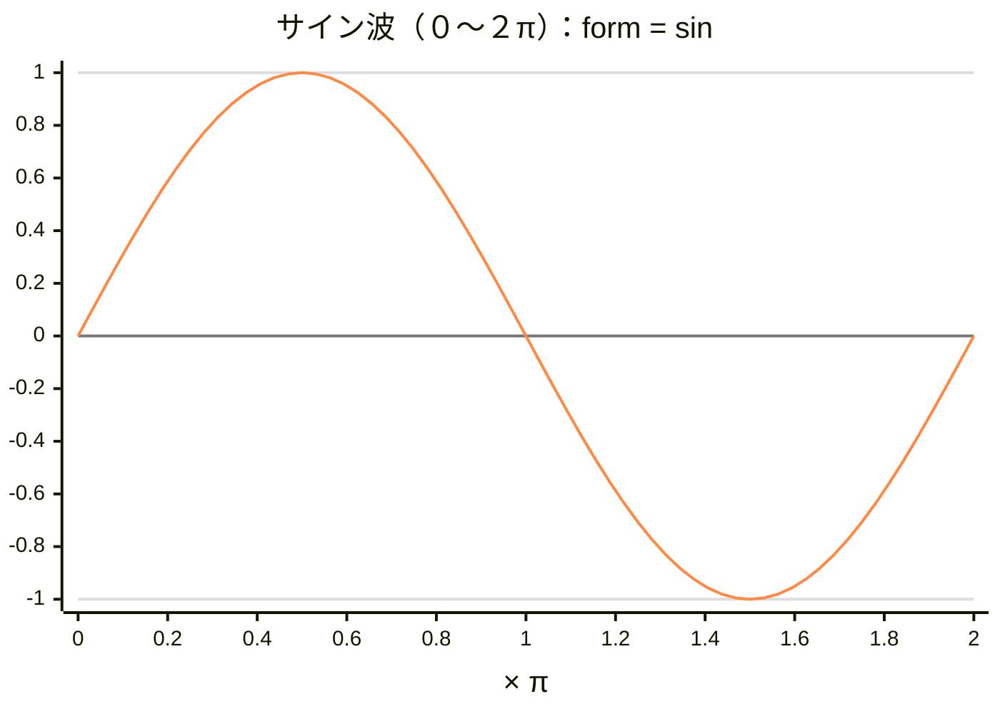

- 【備考】サイン波
  - y=sin(x)

 

---

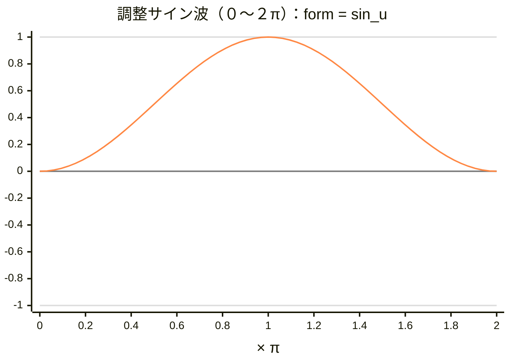

- 【備考】調整サイン波
  - y= (1/2) × sin(x + (3/2)π) ＋ 0.5

 

---

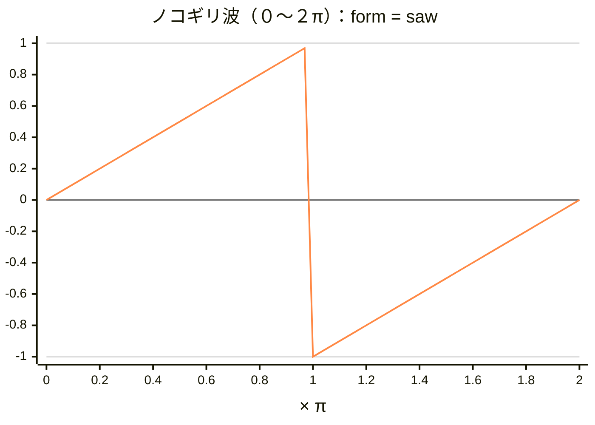

- 【備考】ノコギリ波
  - x=0 のとき y=0
  - x=π未満で、ほぼ y=1
  - x=πのとき y=-1
  - x=２πのとき y=0

 

---

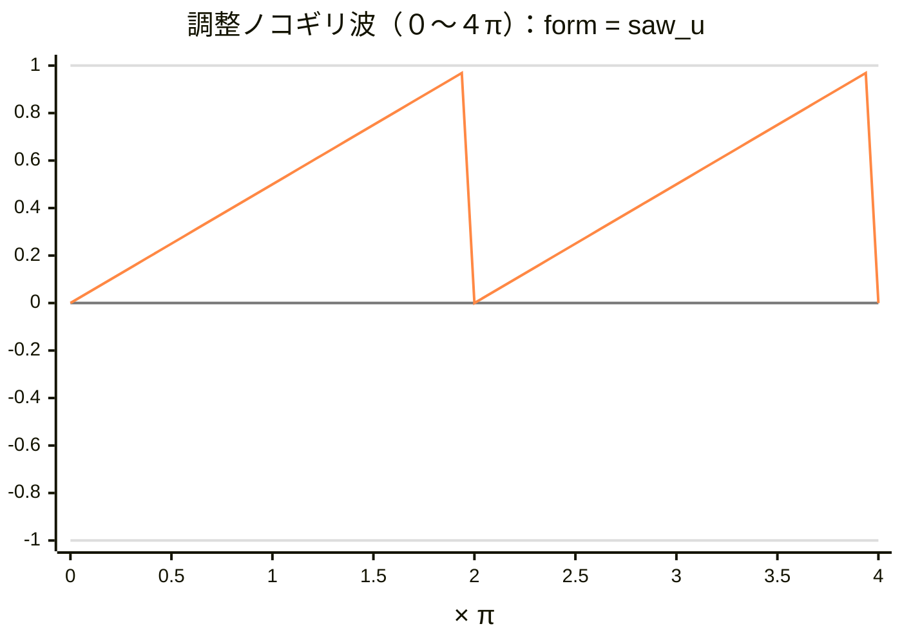

- 【備考】調整ノコギリ波
  - x=0 のとき y=0
  - x=２π未満で、ほぼ y=1
  - x=２πのとき y=0

 

---

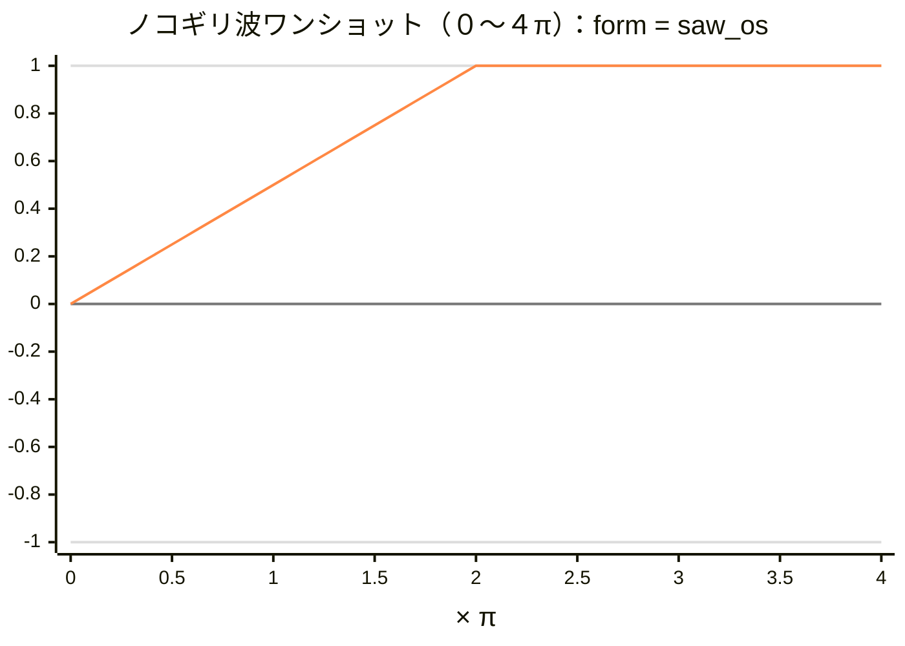

- 【備考】ノコギリ波ワンショット
  - x=0 のとき y=0
  - x=２π未満で、ほぼ y=1
  - x=２π以降で、ずっと y=1

 

---

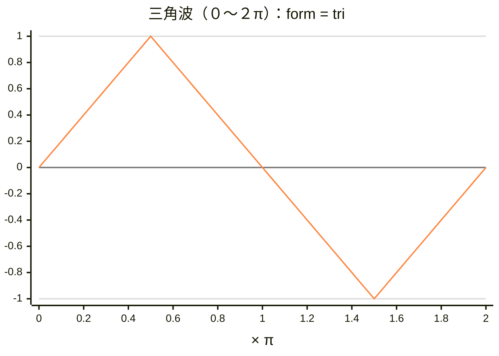

- 【備考】三角波
  - x=0 のとき y=0
  - x=π/２のとき y=1
  - x=３π/２のとき y=-1
  - x=２πのとき y=0

 

---

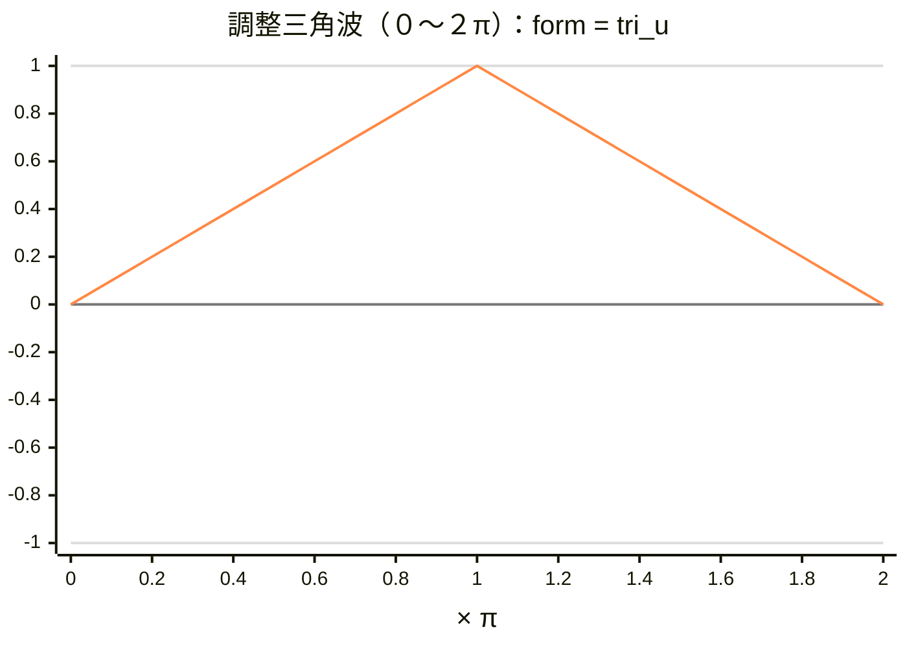

- 【備考】調整三角波
  - x=0 のとき y=0
  - x=πのとき y=1
  - x=２πのとき y=0

 

---

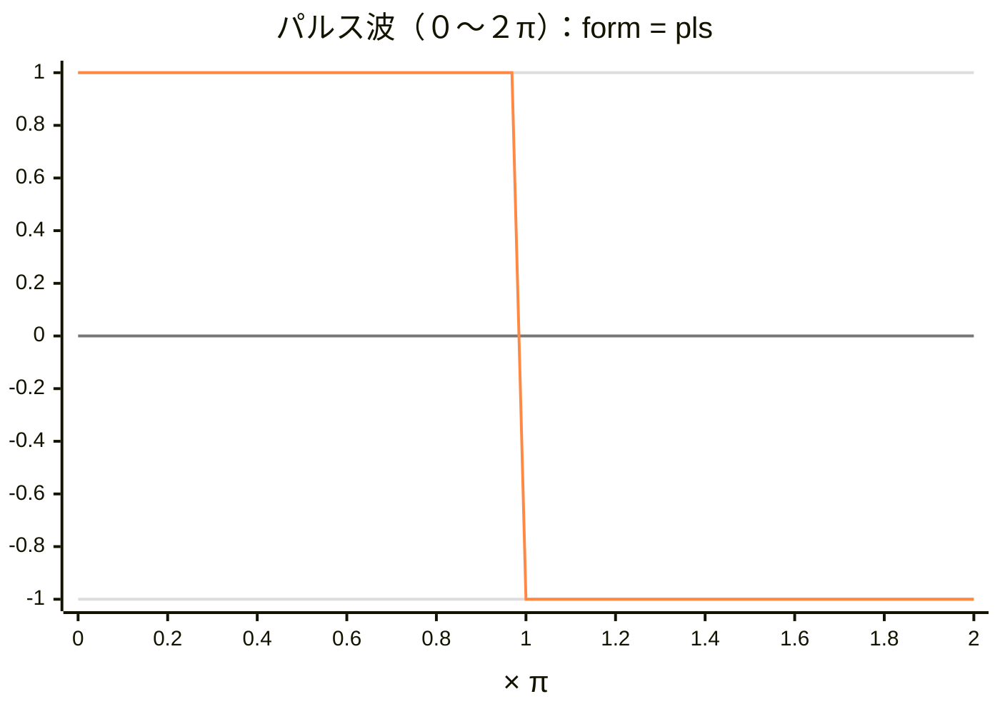

- 【備考】パルス波
  - x=0〜π未満のとき y=1
  - x=π〜２π未満のとき y=-1

 

---

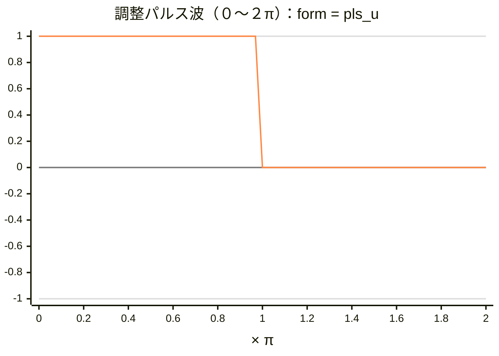

- 【備考】調整パルス波
  - x=0〜π未満のとき y=1
  - x=π〜２π未満のとき y=0

 

---

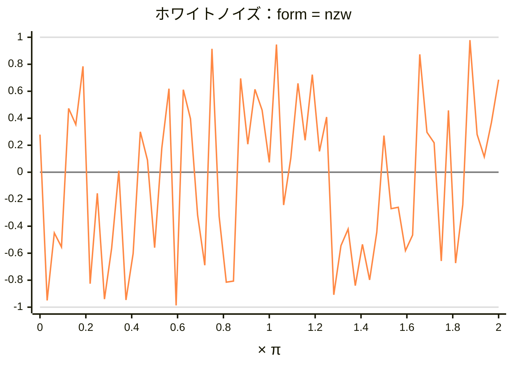

- 【備考】ホワイトノイズ
  - y の値が -1 〜 1 の範囲で、ランダムに変化する

 

---

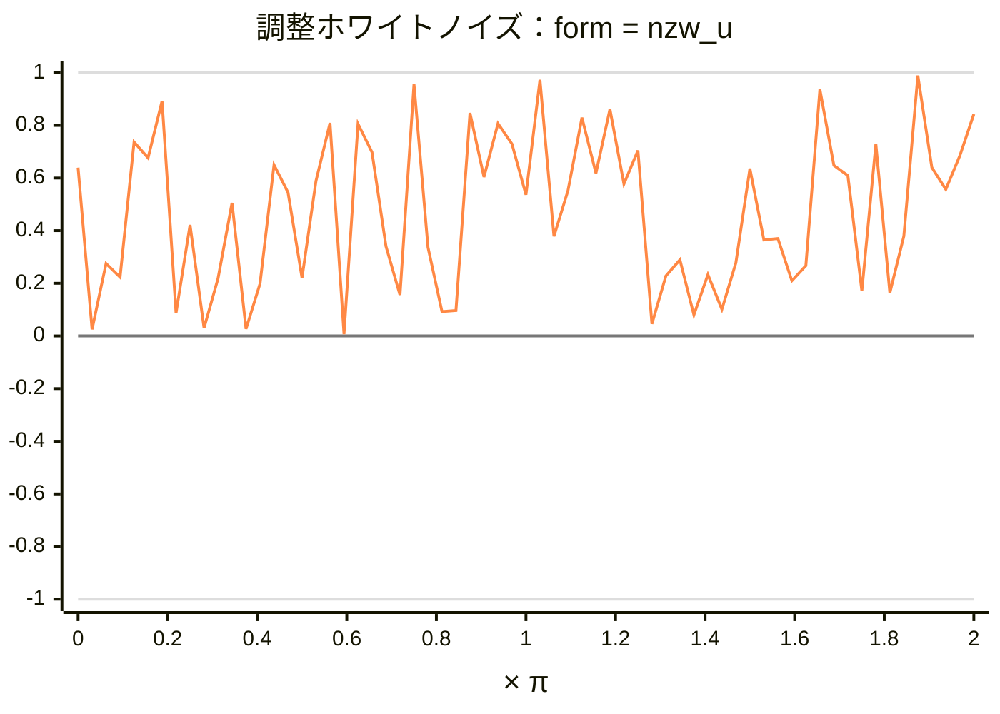

- 【備考】調整ホワイトノイズ
  - y の値が 0 〜 1 の範囲で、ランダムに変化する

 

---

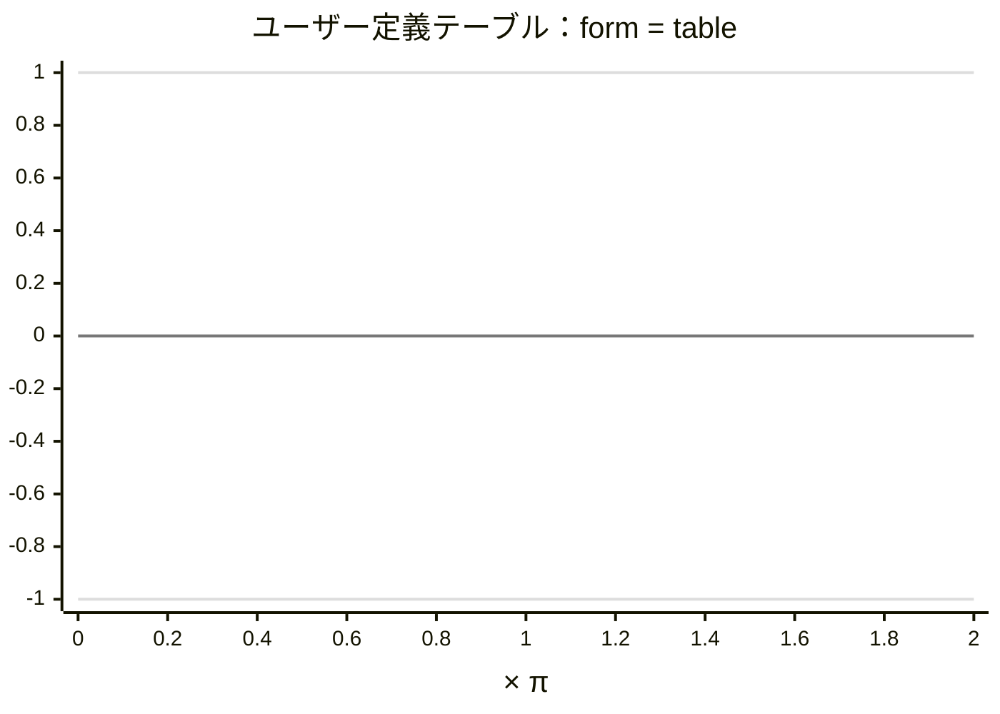

- 【備考】ユーザー定義テーブル
  - テーブル定義により、任意にパターン作成

 

---

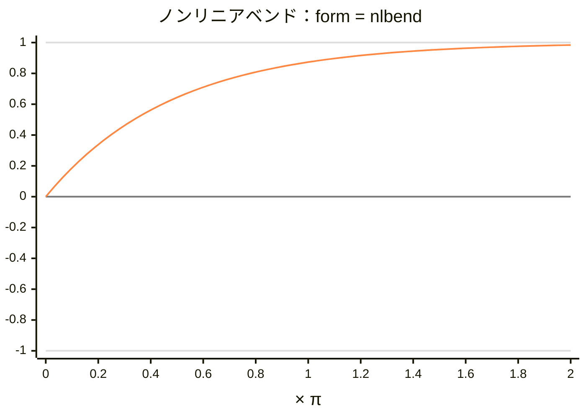

- 【備考】ノンリニアベンド
  - 非線形でベンドする
  - y = 1 - ((1 - p)^x)  
[x=0,1,2,3,4,5,...]  
[pは設定値。グラフでは p=16/256 ]

