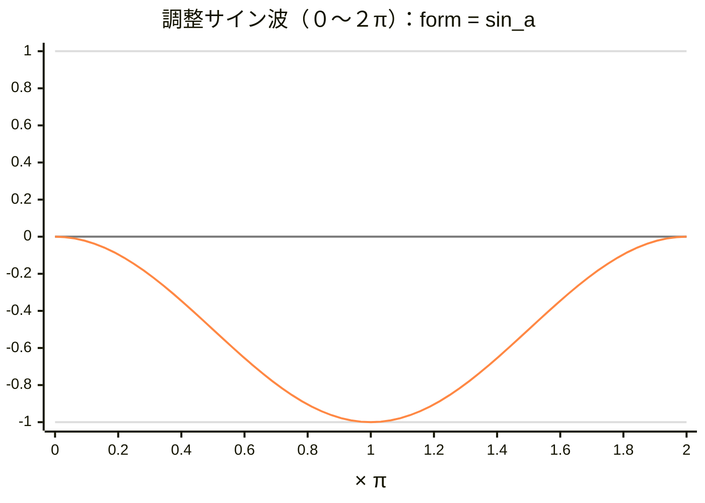
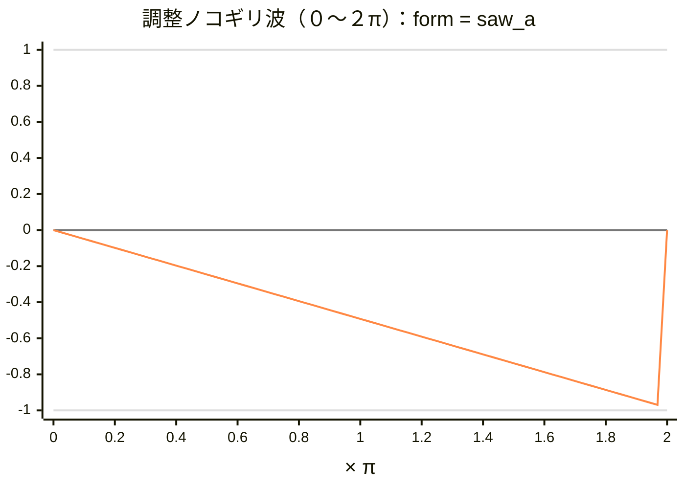
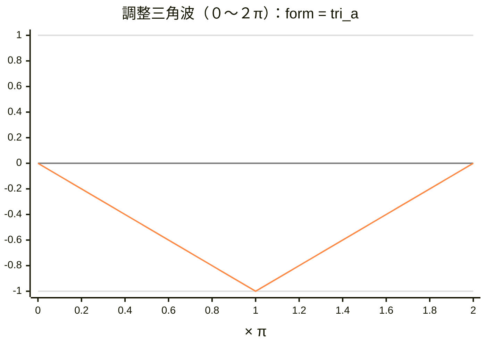
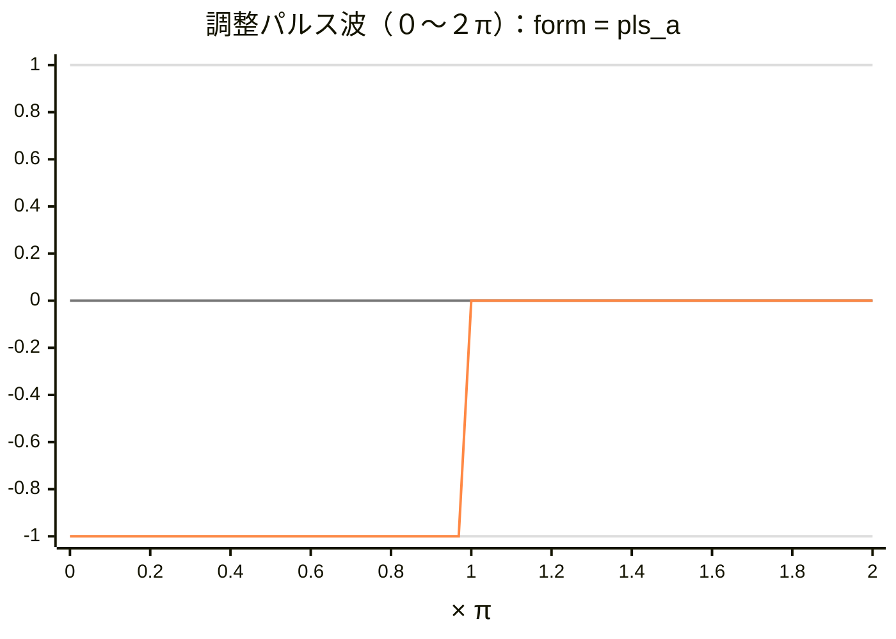
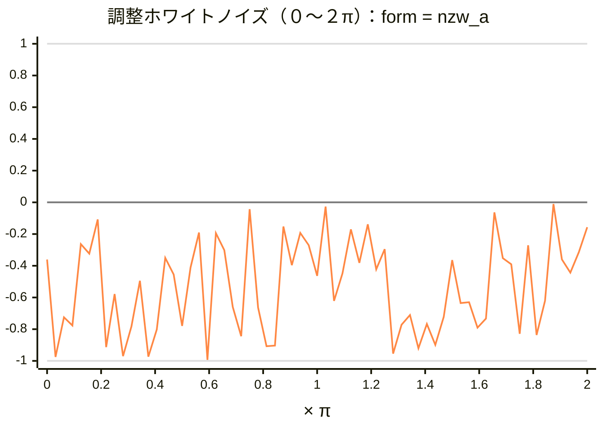
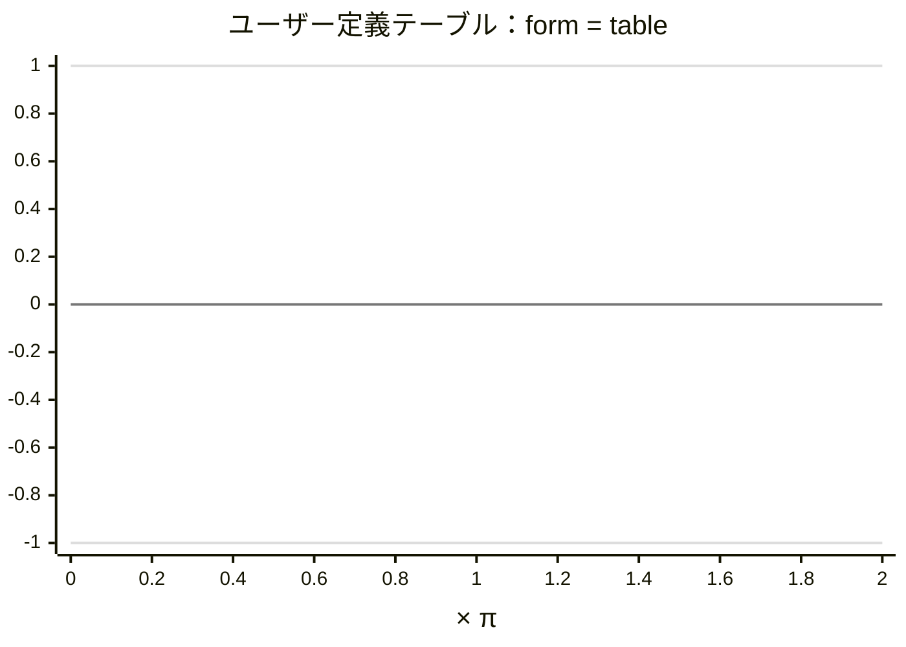

# 8.19 ＬＦＯ波形グラフ（２）（@la）

[← 目次](../index.md)

ＬＦＯ波形グラフ（２）：@laの変化パターン

---

- 【備考】調整サイン波
  - y = (1/2) × sin(x + (1/2)π) - (1/2)

 

---

- 【備考】調整ノコギリ波
  - x=0 のとき y=0
  - x=２π未満で、ほぼ y=-1
  - x=２πのとき y=0

 

---

- 【備考】調整三角波
  - x=0 のとき y=0
  - x=πのとき y=-1
  - x=２πのとき y=0

 

---

- 【備考】調整パルス波
  - x=0〜π未満のとき y=-1
  - x=π〜２π未満のとき y=0

 

---

- 【備考】調整ホワイトノイズ
  - y の値が -1 〜 0 の範囲で、ランダムに変化する

 

---

- 【備考】ユーザー定義テーブル
  - テーブル定義により、任意にパターン作成  
  ただし、yの範囲−１から０まで。

 

