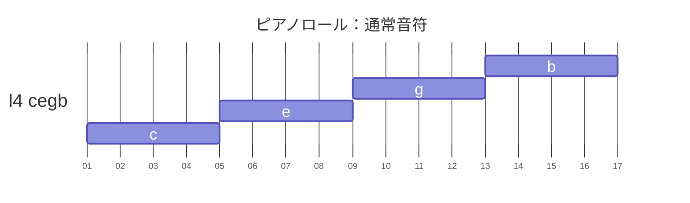
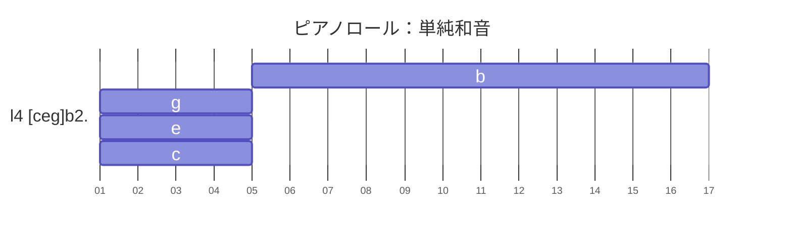
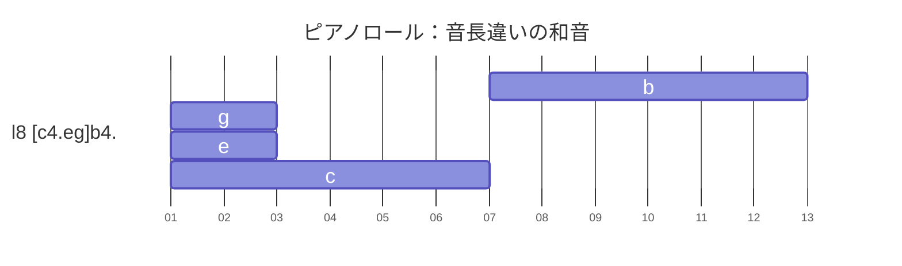
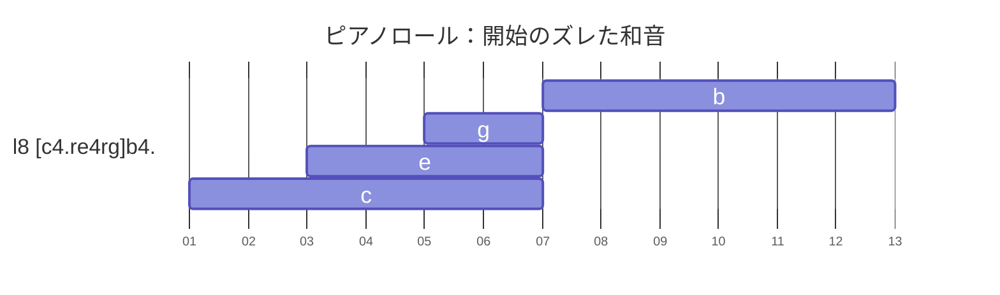

# 9.2 `[...]`：和音記法

[← 目次](../index.md)

## 【解説】

和音記法です。１つのトラックで和音を記述することが出来ます。

ポリフォニックモードが発動しているトラックで、音符を大カッコ `[ ]` で括ると、複数音を同時に鳴らすことが出来ます。

休符（`r`コマンド）によって、大カッコ内での発音タイミングを、ずらすことも出来ます。

ポリフォニックモードを発動するには、対象となるトラックで、`@pl`コマンドを記述します。

【機能制限】  
和音記法 `[ ]` 内では、スラーは使用できません。  
つまり、音符同士の接続の `&` は使えませんが、音長の延長の `&` は使えます。  
[OK] c1&2  
[NG] c1&c2

## 【記述例】

